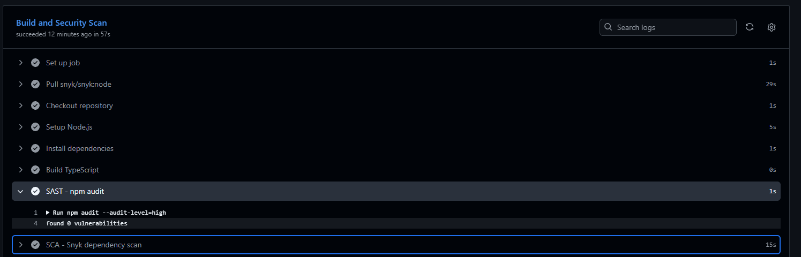

# Secure API

## 1. Описание проекта

`Secure API` --- учебный защищённый REST API, разработанный в рамках
лабораторной работы по информационной безопасности.

Проект реализован на:

-   **Node.js**
-   **TypeScript**
-   **Express**
-   **PostgreSQL**
-   **JWT**
-   **bcrypt**
-   **Snyk**
-   **GitHub Actions**

API предназначен для работы с пользователями и постами. Реализованы
регистрация и аутентификация пользователей, получение данных, а также
создание, получение, изменение и удаление постов.

Приложение запускается локально на:

``` text
http://localhost:3000
```

------------------------------------------------------------------------

## 2. Запуск проекта

### Требования

-   Node.js 20+
-   npm
-   PostgreSQL
-   Git

### Установка зависимостей

``` bash
npm install
```

### Настройка `.env`

Создайте файл `.env` в корне проекта:

``` env
PORT=3000

DB_HOST=localhost
DB_PORT=5432
DB_NAME=secure_api
DB_USER=secure_api_user
DB_PASSWORD=secure_password

JWT_SECRET=your-super-secret-key-change-me
JWT_EXPIRES_IN=1h
```

> Файл `.env` не должен добавляться в Git. Он находится в `.gitignore`.

### Сборка

``` bash
npm run build
```

### Запуск

Для разработки:

``` bash
npm run dev
```

Для запуска собранного проекта:

``` bash
npm start
```

------------------------------------------------------------------------

# 3. API

Все защищённые endpoints требуют HTTP-заголовок:

``` http
Authorization: Bearer <JWT_TOKEN>
```

## 3.1. Регистрация

### `POST /auth/register`

Создаёт нового пользователя.

**Request:**

``` http
POST http://localhost:3000/auth/register
Content-Type: application/json
```

``` json
{
  "username": "testuser",
  "password": "password123"
}
```

**Успешный ответ:**

``` json
{
  "user": {
    "id": 1,
    "username": "testuser"
  }
}
```

Код ответа:

``` text
201 Created
```

При повторной регистрации существующего имени:

``` text
409 Conflict
```

------------------------------------------------------------------------

## 3.2. Авторизация

### `POST /auth/login`

Проверяет логин и пароль и выдаёт JWT.

**Request:**

``` http
POST http://localhost:3000/auth/login
Content-Type: application/json
```

``` json
{
  "username": "testuser",
  "password": "password123"
}
```

**Успешный ответ:**

``` json
{
  "message": "Login successful",
  "token": "<JWT_TOKEN>",
  "user": {
    "id": 1,
    "username": "testuser"
  }
}
```

Полученный `token` используется для доступа к защищённым endpoint'ам.

------------------------------------------------------------------------

## 3.3. Получение всех постов

### `GET /api/data`

Возвращает список постов с информацией об авторе.

**Request:**

``` http
GET http://localhost:3000/api/data
Authorization: Bearer <JWT_TOKEN>
```

**Пример ответа:**

``` json
{
  "posts": [
    {
      "id": 1,
      "title": "First post",
      "content": "Hello!",
      "user_id": 1,
      "username": "testuser",
      "created_at": "2026-09-23T10:00:00.000Z"
    }
  ]
}
```

Без JWT:

``` text
401 Unauthorized
```

------------------------------------------------------------------------

## 3.4. Создание поста

### `POST /api/posts`

Создаёт пост от имени пользователя, указанного в JWT.

**Request:**

``` http
POST http://localhost:3000/api/posts
Authorization: Bearer <JWT_TOKEN>
Content-Type: application/json
```

``` json
{
  "title": "My post",
  "content": "Post content"
}
```

Поле `user_id` клиентом не передаётся. ID пользователя берётся из
проверенного JWT.

**Ответ:**

``` text
201 Created
```

``` json
{
  "post": {
    "id": 1,
    "title": "My post",
    "content": "Post content",
    "user_id": 1,
    "created_at": "2026-09-23T10:00:00.000Z"
  }
}
```

------------------------------------------------------------------------

## 3.5. Получение одного поста

### `GET /api/posts/:id`

Возвращает пост по идентификатору.

**Request:**

``` http
GET http://localhost:3000/api/posts/1
Authorization: Bearer <JWT_TOKEN>
```

**Успешный ответ:**

``` json
{
  "post": {
    "id": 1,
    "title": "My post",
    "content": "Post content",
    "user_id": 1,
    "username": "testuser",
    "created_at": "2026-09-23T10:00:00.000Z"
  }
}
```

Если пост отсутствует:

``` text
404 Not Found
```

------------------------------------------------------------------------

## 3.6. Изменение поста

### `PUT /api/posts/:id`

Изменяет существующий пост.

**Request:**

``` http
PUT http://localhost:3000/api/posts/1
Authorization: Bearer <JWT_TOKEN>
Content-Type: application/json
```

``` json
{
  "title": "Updated title",
  "content": "Updated content"
}
```

Изменить пост может только пользователь, которому он принадлежит.

**Успешный ответ:**

``` text
200 OK
```

------------------------------------------------------------------------

## 3.7. Удаление поста

### `DELETE /api/posts/:id`

Удаляет пост.

**Request:**

``` http
DELETE http://localhost:3000/api/posts/1
Authorization: Bearer <JWT_TOKEN>
```

Удалить пост может только его владелец.

**Успешный ответ:**

``` text
204 No Content
```

------------------------------------------------------------------------

# 4. Структура API

  Метод    Endpoint           Авторизация   Назначение
  -------- ------------------ ------------- --------------------------------
  POST     `/auth/register`   Нет           Регистрация
  POST     `/auth/login`      Нет           Аутентификация и получение JWT
  GET      `/api/data`        JWT           Получение всех постов
  POST     `/api/posts`       JWT           Создание поста
  GET      `/api/posts/:id`   JWT           Получение поста
  PUT      `/api/posts/:id`   JWT           Изменение своего поста
  DELETE   `/api/posts/:id`   JWT           Удаление своего поста

------------------------------------------------------------------------

# 5. Реализованные меры защиты

## 5.1. Защита от SQL Injection

Для работы с PostgreSQL используется библиотека `pg`.

SQL-запросы не формируются конкатенацией пользовательского ввода.

Небезопасный вариант:

``` ts
const query =
  "SELECT * FROM users WHERE username = '" + username + "'";
```

В проекте используется параметризация:

``` ts
const result = await pool.query(
  `
    SELECT id, username, password_hash
    FROM users
    WHERE username = $1
  `,
  [username],
);
```

Значение `username` передаётся отдельно от SQL-кода как параметр `$1`.

Аналогично параметризованы операции с постами:

``` ts
await pool.query(
  `
    INSERT INTO posts (title, content, user_id)
    VALUES ($1, $2, $3)
  `,
  [sanitizedTitle, sanitizedContent, userId],
);
```

И операции изменения и удаления:

``` sql
WHERE id = $1 AND user_id = $2
```

Таким образом, пользовательский ввод не интерпретируется PostgreSQL как
часть SQL-команды.

Для проверки SQL Injection в Postman используется запрос с тестовым
значением, например:

``` text
' OR '1'='1
```

------------------------------------------------------------------------

## 5.2. Защита от XSS

Для обработки пользовательского текста используется пакет `validator`.

В проекте создана функция:

``` ts
import validator from "validator";

export const sanitizeText = (value: string): string => {
  return validator.escape(value);
};
```

Она экранирует специальные HTML-символы.

Например, потенциально опасный ввод:

``` html
<script>alert('XSS')</script>
```

перед сохранением обрабатывается функцией:

``` ts
sanitizeText(value)
```

и HTML-символы преобразуются в безопасное текстовое представление.

Санитизация применяется к полям:

-   `title`
-   `content`

при создании и изменении поста.

Также входные значения проверяются на соответствие ожидаемому типу:

``` ts
if (
  typeof title !== "string" ||
  typeof content !== "string"
) {
  return res.status(400).json({
    message: "Title and content must be strings",
  });
}
```

Это предотвращает передачу неожиданных типов данных в API.

------------------------------------------------------------------------

## 5.3. Аутентификация с помощью JWT

Для аутентификации используется **JSON Web Token (JWT)**.

После успешной проверки логина и пароля сервер создаёт токен:

``` ts
const token = jwt.sign(
  {
    userId: user.id,
    username: user.username,
  },
  JWT_SECRET,
  {
    expiresIn: "1h",
  },
);
```

В токен помещается идентификатор пользователя и его имя.

Для защищённых endpoint'ов используется middleware:

``` ts
authenticateToken
```

Middleware извлекает токен из заголовка:

``` http
Authorization: Bearer <JWT_TOKEN>
```

После этого выполняется:

``` ts
jwt.verify(token, JWT_SECRET)
```

Если токен:

-   отсутствует;
-   имеет неправильный формат;
-   недействителен;
-   просрочен;

API возвращает:

``` text
401 Unauthorized
```

Защита применяется к `/api/data` и всем endpoint'ам `/api/posts`.

------------------------------------------------------------------------

## 5.4. Безопасное хранение паролей

Пароли пользователей не хранятся в базе данных в открытом виде.

Для хеширования используется `bcrypt`:

``` ts
const passwordHash = await bcrypt.hash(password, 12);
```

В базе сохраняется только результат хеширования:

``` text
password_hash
```

При авторизации пароль проверяется:

``` ts
const passwordValid = await bcrypt.compare(
  password,
  user.password_hash,
);
```

Таким образом, исходный пароль пользователя не сохраняется в базе
данных.

------------------------------------------------------------------------

## 5.5. Защита от изменения чужих постов

При обновлении поста проверяется не только его ID, но и ID пользователя:

``` sql
UPDATE posts
SET title = $1,
    content = $2
WHERE id = $3
  AND user_id = $4
```

Значение `user_id` берётся из проверенного JWT:

``` ts
req.user!.userId
```

Аналогичная проверка используется при удалении:

``` sql
DELETE FROM posts
WHERE id = $1
  AND user_id = $2
```

Поэтому пользователь не может изменить или удалить пост другого
пользователя, просто изменив `id` в URL.

------------------------------------------------------------------------

## 5.6. Валидация входных данных

API проверяет наличие и тип обязательных параметров.

Например, при регистрации:

``` ts
if (!username || !password) {
  return res.status(400).json({
    message: "Username and password are required",
  });
}
```

Также проверяются ограничения имени пользователя и пароля:

``` text
username: 3–100 символов
password: минимум 8 символов
```

Для полей поста проверяется, что `title` и `content` являются строками.

------------------------------------------------------------------------

# 6. CI/CD и security scanning

Для автоматической проверки используется **GitHub Actions**.

Workflow находится в:

``` text
.github/workflows/ci.yml
```

Pipeline запускается автоматически:

-   при `push` в репозиторий;
-   при создании или обновлении Pull Request.

## SAST

В pipeline выполняется статический анализатор кода:

``` bash
npm audit --audit-level=high
```

При последнем прогоне не выявлено уязвимостей 


## SCA

Для анализа сторонних зависимостей используется Snyk:

``` yaml
- name: SCA - Snyk dependency scan
  uses: snyk/actions/node@v1
  env:
    SNYK_TOKEN: ${{ secrets.SNYK_TOKEN }}
  with:
    args: --severity-threshold=high
    json: true
```

Snyk анализирует зависимости проекта, указанные в `package.json` и
`package-lock.json`, и проверяет их на известные уязвимости.

Для CI используется секрет GitHub:

``` text
SNYK_TOKEN
```

Сформированный отчёт Snyk сохраняется GitHub Actions как artifact.

Уязвимостей во внешних зависимостях не было выявлено 


------------------------------------------------------------------------

# 7. Тестирование API

Для ручного тестирования используется Postman.

Коллекция `secure-api.postman_collection.json` содержит проверки:

-   регистрации
-   авторизации;
-   получения данных;
-   создания поста;
-   получения поста;
-   изменения поста;
-   удаления поста;
-   запросов без JWT;
-   недействительного JWT;
-   SQL Injection;
-   XSS.

Пример защищённого запроса:

``` http
GET /api/data
Authorization: Bearer <JWT_TOKEN>
```

Пример проверки отсутствия авторизации:

``` http
GET /api/data
```

Ожидаемый результат:

``` text
401 Unauthorized
```

------------------------------------------------------------------------

# 9. Структура проекта

``` text
secure-api/
├── .github/
│   └── workflows/
│       └── ci.yml
├── src/
│   ├── config/
│   │   └── database.ts
│   ├── controllers/
│   │   ├── auth.controller.ts
│   │   ├── data.controller.ts
│   │   └── posts.controller.ts
│   ├── middleware/
│   │   └── auth.middleware.ts
│   ├── routes/
│   │   ├── auth.routes.ts
│   │   ├── data.routes.ts
│   │   └── posts.routes.ts
│   ├── types/
│   │   └── express.d.ts
│   ├── utils/
│   │   └── sanitize.ts
│   └── app.ts
├── docs/
│   └── screenshots/
│       ├── sast.png
│       └── sca.png
├── .env
├── .gitignore
├── package.json
├── package-lock.json
└── tsconfig.json
```

> `.env` не должен попадать в репозиторий, поскольку содержит секреты
> подключения к базе данных и JWT secret.
